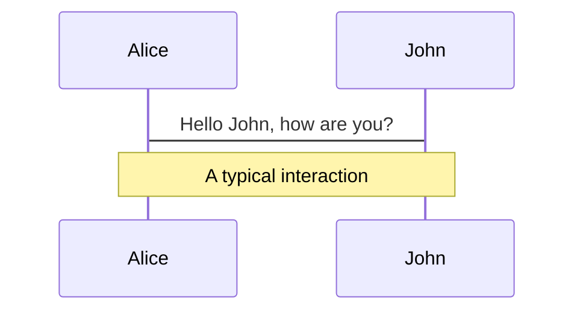
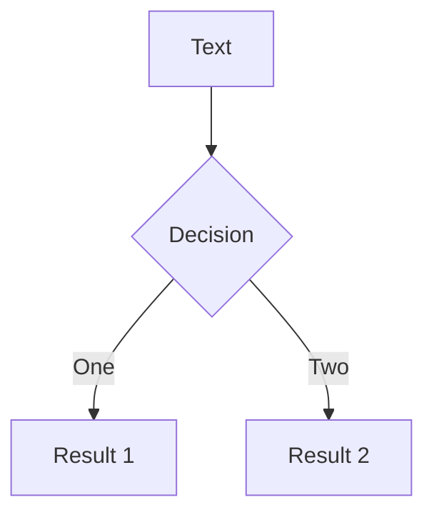
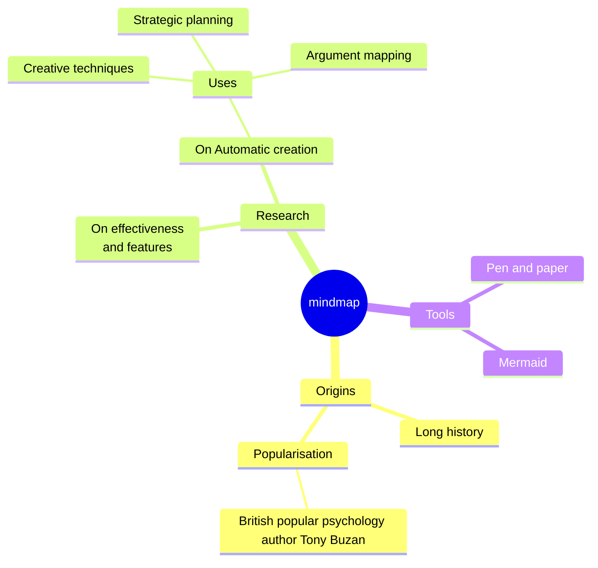
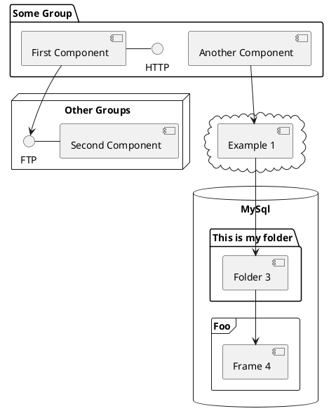

---
# You can also start simply with 'default'
theme: seriph
# random image from a curated Unsplash collection by Anthony
# like them? see https://unsplash.com/collections/94734566/slidev
background: https://cover.sli.dev
# some information about your slides (markdown enabled)
title: Welcome to Slidev
info: |
  ## Slidev Starter Template
  Presentation slides for developers.

  Learn more at [Sli.dev](https://sli.dev)
# apply unocss classes to the current slide
class: text-center
# https://sli.dev/features/drawing
drawings:
  persist: false
# slide transition: https://sli.dev/guide/animations.html#slide-transitions
# enable MDC Syntax: https://sli.dev/features/mdc
mdc: true
# open graph
# seoMeta:
#  ogImage: https://cover.sli.dev
themeConfig:
  paginationX: r
  paginationY: t
  paginationPagesDisabled: [1]
---

# Chef Training

Mischa Taylor

<div @click="$slidev.nav.next" class="mt-12 py-1" hover:bg="white op-10">
  Press Space for next page <carbon:arrow-right />
</div>

<div class="abs-br m-6 text-xl">
  <button @click="$slidev.nav.openInEditor()" title="Open in Editor" class="slidev-icon-btn">
    <carbon:edit />
  </button>
  <a href="https://github.com/slidevjs/slidev" target="_blank" class="slidev-icon-btn">
    <carbon:logo-github />
  </a>
</div>

<!--
The last comment block of each slide will be treated as slide notes. It will be visible and editable in Presenter Mode along with the slide. [Read more in the docs](https://sli.dev/guide/syntax.html#notes)
-->

---
hideInToc: true
routeAlias: toc
---

# Table of Contents

<Toc columns="2"/>

---
hideInToc: true
---

# Cinc Workstation Install - Ubuntu

Use the installation script provided by Cinc. The script detects your OS version and downloads the appropriate package.

```bash
curl -L https://omnitruck.cinc.sh/install.sh | sudo bash -s -- -P cinc-workstation
```

Verify the installation:

```bash
cinc --version
```

Should list the versions of all the Cinc-related tools:

```bash
Cinc Workstation version: 25.2.1075
Cinc CLI version: 5.6.16
Biome version: 1.6.821
Test Kitchen version: 3.6.0
Cookstyle version: 7.32.8
Cinc Client version: 18.6.2
Cinc Auditor version: 5.22.65
```

---
hideInToc: true
---

# Configure the Ruby environment (simple)

Configure the Ruby environment Cinc uses by adding the following commands to the configuration file for bash (~/.bashrc):

```bash
# Add the Cinc Workstation initialization content
echo 'eval "$(cinc shell-init bash)"' >> ~/.bashrc
```

Reload the config in the current shell with source ~/.bashrc or restart the current terminal.

Verify that the Ruby interpreter being used is the cin-workstation ruby instead of the system ruby:

```bash
% which ruby
/opt/cinc-workstation/embedded/bin/ruby
```

---
hideInToc: true
---

# Configure bridged network with NetworkManager

```bash
# This is the network config written by 'subiquity'
network:
  version: 2
  renderer: NetworkManager
  ethernets:
    eno1:
      dhcp4: false
      dhcp6: false
      optional: true
  bridges:
    br0:
      dhcp4: true
      dhcp6: false
      accept-ra: false
      link-local: []
      interfaces:
        - eno1
```

---
hideInToc: true
---

# Install QEMU/KVM on Ubuntu 24.04

Install QEMU/KVM and libvirtd

```bash
sudo apt-get update
sudo apt-get install qemu-kvm libvirt-daemon-system
sudo apt-get install virtinst
```

Make sure the current user is a member of the libvirt and kvm groups

```bash
$ sudo adduser $(id -un) libvirt
$ sudo adduser $(id -un) kvm
```

Be sure to reboot!!!

```bash
sudo reboot
```

---
hideInToc: true
---

# Create a definition for the host network (1 of 2)

Create XML definition

```bash
cat <<EOF > /tmp/host-network.xml
<network>
  <name>host-network</name>
  <forward mode="bridge"/>
  <bridge name="br0" />
</network>
EOF
```

Configure

```bash
$ sudo virsh net-define /tmp/host-network.xml
$ sudo virsh net-start host-network
$ sudo virsh net-autostart host-network
```

---
hideInToc: true
---

```bash
$ virsh net-list --all
 Name           State    Autostart   Persistent
-------------------------------------------------
 default        active   yes         yes
 host-network   active   yes         yes
```

---
hideInToc: true
---

# Image pool

```bash
$ virsh pool-define-as \
    --name default \
    --type dir \
    --target /var/lib/libvirt/images
$ virsh pool-build default
$ virsh pool-start default
$ virsh pool-autostart default
```

```bash
$ virsh pool-list --all
$ virsh vol-list --pool default --details
```

# cloud-init image pool

```bash
$ virsh pool-define-as \
    --name boot-scratch \
    --type dir \
    --target /var/lib/libvirt/boot
$ virsh pool-build boot-scratch
$ virsh pool-start boot-scratch
$ virsh pool-autostart boot-scratch
```

```bash
$ virsh pool-list --all
$ virsh vol-list --pool boot-scratch --details
```

---
hideInToc: true
---

# ISO image pool

```bash
$ virsh pool-define-as \
    --name iso \
    --type dir \
    --target /var/lib/libvirt/iso
$ virsh pool-build iso
$ virsh pool-start iso
$ virsh pool-autostart iso
```

```bash
$ virsh pool-list --all
$ virsh vol-list --pool iso --details
```

---
hideInToc: true
---

```bash
$ virsh nodeinfo
CPU model:           x86_64
CPU(s):              12
CPU frequency:       3916 MHz
CPU socket(s):       1
Core(s) per socket:  6
Thread(s) per core:  2
NUMA cell(s):        1
Memory size:         65627760 KiB
```

```bash
$ df -h
Filesystem      Size  Used Avail Use% Mounted on
tmpfs           6.3G  2.4M  6.3G   1% /run
/dev/nvme2n1p2  1.8T   14G  1.7T   1% /
tmpfs            32G     0   32G   0% /dev/shm
tmpfs           5.0M   12K  5.0M   1% /run/lock
efivarfs        192K   70K  118K  38% /sys/firmware/efi/efivars
tmpfs            32G     0   32G   0% /run/qemu
/dev/nvme2n1p1  1.1G  6.2M  1.1G   1% /boot/efi
tmpfs           6.3G  112K  6.3G   1% /run/user/1000
/dev/sda1        58G   53G  5.0G  92% /media/automat/Ventoy
```

---
hideInToc: true
---

# Download could image template and resize

```bash
```

---
hideInToc: true
---

# Download cloud image template and resize

```bash
sudo apt get update
sudo apt-get install curl
```
```bash
curl -LO https://cloud-images.ubuntu.com/noble/current/noble-server-cloudimg-amd64.img
```

```bash
$ qemu-img info noble-server-cloudimg-amd64.img
$ sudo qemu-img convert \
    -f qcow2 -O qcow2 \
    noble-server-cloudimg-amd64.img \
    /var/lib/libvirt/images/ubuntu-server-2404.qcow2
$ sudo qemu-img resize -f qcow2 \
    /var/lib/libvirt/images/ubuntu-server-2404.qcow2 \
    64G
````

---
hideInToc: true
---

# Define login parameters for cloud-init ISO

```bash
# Required for NoCloud module to function, uniquely identifies instance
cat >meta-data <<EOF
instance-id: ubuntu-server-2404
local-hostname: ubuntu-server-2404
EOF
```

```bash
# Main configuration script, tells cloud-init what to do when instance starts
cat >user-data <<EOF
#cloud-config
hostname: ubuntu-server-2404
users:
  - name: automat
    uid: 63112
    primary_group: users
    groups: users
    shell: /bin/bash
    plain_text_passwd: superseekret
    sudo: ALL=(ALL) NOPASSWD:ALL
    lock_passwd: false
chpasswd: { expire: False }
ssh_pwauth: True
package_update: False
package_upgrade: false
packages:
  - qemu-guest-agent
growpart:
  mode: auto
  devices: ['/']
power_state:
  mode: reboot
EOF
```

---
hideInToc: true
---

```bash
sudo apt-get update
sudo apt-get install genisoimage
```

```bash
$ genisoimage \
    -input-charset utf-8 \
    -output ubuntu-server-2404-cloud-init.img \
    -volid cidata -rational-rock -joliet \
    user-data meta-data

sudo cp ubuntu-server-2404-cloud-init.img \
  /var/lib/libvirt/boot/ubuntu-server-2404-cloud-init.iso
```

---
hideInToc: true
---

```bash
virt-install \
  --connect qemu:///system \
  --name ubuntu-server-2404 \
  --boot uefi \
  --memory 2048 \
  --vcpus 2 \
  --os-variant ubuntu24.04 \
  --disk /var/lib/libvirt/images/ubuntu-server-2404.qcow2,bus=virtio \
  --disk /var/lib/libvirt/boot/ubuntu-server-2404-cloud-init.iso,device=cdrom \
  --network network=host-network,model=virtio \
  --graphics spice \
  --noautoconsole \
  --console pty,target_type=serial \
  --import \
  --debug
```

---
hideInToc: true
---

# Virtual machine console

```bash
# Command line console
virsh console ubuntu-server-2404

# Graphical console
virt-viewer ubuntu-server-2404
```

---
hideInToc: true
---

# Disable cloud-init and remove cloud-init ISO

In the guest:

```bash
# login with ubuntu user
$ cloud-init status
status: done

# Disable cloud-init
$ sudo touch /etc/cloud/cloud-init.disabled
$ sudo shutdown -h now
```

On the host
```bash
$ virsh domblklist ubuntu-server-2404
$ virsh change-media ubuntu-server-2404 sda --eject
$ sudo rm /var/lib/libvirt/boot/ubuntu-server-2404-cloud-init.iso
```

---
hideInToc: true
---

# Snapshots

```bash
$ virsh snapshot-create-as --domain ubuntu-server-2404 --name clean --description "Initial install"
$ virsh snapshot-list ubuntu-server-2404
$ virsh snapshot-revert ubuntu-server-2404 clean
$ virsh snapshot-delete ubuntu-server-2404 clean
```

# Cleanup
```bash
$ virsh shutdown ubuntu-server-2404
$ virsh undefine ubuntu-server-2404 --nvram --remove-all-storage
```

# Get IP of virtual machine
```bash
$ virsh domifaddr ubuntu-server-2404 --source agent
```

---
hideInToc: true
---

# boxcutter chef-client

```bash
# Login to the VM with automat/superseekret
virsh console ubuntu-server-2404
# login with automat/superseekret

# chefctl uses a shebang that points at /opt/chef, so make sure we have a link
# in place for compatibility
sudo mkdir -p /etc/cinc
# -n must be here in case /etc/chef already exists, otherwise
# it tries to create /etc/chef/cinc
# /etc/chef -> /etc/cinc
sudo ln -snf /etc/cinc /etc/chef

curl -L https://omnitruck.cinc.sh/install.sh | sudo bash
curl -L https://omnitruck.cinc.sh/install.sh | sudo bash -s -- -v 18.6.2


# /opt/chef -> /opt/cinc
sudo ln -snf /opt/cinc /opt/chef

## prime onepassword secret /etc/cinc/op_service_account_token
## Install 1Password cli
# sudo apt-get update
# sudo apt-get install unzip
# ARCH="<choose between 386/amd64/arm/arm64>"
# curl -o /tmp/op.zip https://cache.agilebits.com/dist/1P/op2/pkg/v2.30.3/op_linux_amd64_v2.30.3.zip
# sudo unzip /tmp/op.zip op -d /usr/local/bin/
# rm -f /tmp/op.zip
 
# op user get --me 

sudo tee /etc/cinc/client-prod.rb <<EOF
local_mode true
chef_repo_path '/var/chef/repos/boxcutter-chef-cookbooks'
cookbook_path ['/var/chef/repos/chef-cookbooks/cookbooks', '/var/chef/repos/boxcutter-chef-cookbooks/cookbooks']
follow_client_key_symlink true
client_fork false
no_lazy_load false
local_key_generation true
json_attribs '/etc/cinc/run-list.json'
ohai.critical_plugins ||= []
ohai.critical_plugins += [:Passwd]
ohai.optional_plugins ||= []
ohai.optional_plugins += [:Passwd]
EOF

sudo openssl genrsa -out /etc/cinc/client-prod.pem
sudo openssl genrsa -out /etc/cinc/validation.pem

sudo ln -sf /etc/cinc/client-prod.rb /etc/chef/client.rb
sudo ln -sf /etc/cinc/client-prod.pem /etc/chef/client.pem

sudo tee /etc/chef/chefctl_hooks.rb <<EOF
EOF

sudo tee /etc/chefctl-config.rb <<EOF
chef_client '/opt/cinc/bin/cinc-client'
chef_options ['--no-fork']
log_dir '/var/log/chef'
EOF

sudo tee /etc/chef/run-list.json <<EOF
{
  "run_list" : [
    "recipe[boxcutter_ohai]",
    "recipe[boxcutter_init]"
  ]
}
EOF

sudo apt-get install git
sudo mkdir -p /var/chef /var/chef/repos /var/log/chef
cd /var/chef/repos
sudo git clone https://github.com/boxcutter/chef-cookbooks.git \
  /var/chef/repos/chef-cookbooks
sudo git clone https://github.com/boxcutter/boxcutter-chef-cookbooks.git \
  /var/chef/repos/boxcutter-chef-cookbooks

sudo mkdir -p /usr/local/sbin
sudo curl -o /usr/local/sbin/chefctl.rb \
  https://raw.githubusercontent.com/facebook/chef-utils/main/chefctl/src/chefctl.rb
sudo chmod +x /usr/local/sbin/chefctl.rb
sudo ln -sf /usr/local/sbin/chefctl.rb /usr/local/sbin/chefctl

sudo touch /root/firstboot_os
echo "{\"tier\": \"robot\"}" | sudo tee /etc/boxcutter-config.json > /dev/null
sudo chefctl -iv

# Behind the scenes, it'sdoing this:
# /opt/cinc/bin/cinc-client -c /etc/cinc/client.rb -j /etc/chef/run-list.json
# /opt/cinc/bin/cinc-client --config /etc/cinc/client.rb --json-attributes /etc/chef/run-list.json
```

---
hideInToc: true
---

# polymathrobotics bootstrap

1. Make sure your ssh key is registered in Rippling: https://www.notion.so/polymathrobotics/Rippling-SSH-Public-Key-Management-4e36dabf29454e68b566ada3a7f0949a?pvs=4

2. Request a sandbox bootstrapping token from the #infra team, so that automation code can access secrets from 1Password. This will normally be a 1Password Service Account token with limited permissions to deploy to sandbox environments and not any production environments (sandbox tokens are limited tokens for testing).

3. Copy bootstrap_chef.sh to your target system. Most straightforward way until you learn more about our automation is to grab it from Github: https://github.com/polymathrobotics/polymath-chef-cookbooks/blob/main/cookbooks/polymath_chef/files/bootstrap_chef.sh


---
hideInToc: true
---

# polymathrobotics bootstrap

```bash
# Become root because the provisioning user will lose sudo privileges
sudo su -
export OP_SERVICE_ACCOUNT_TOKEN=<token_from_infra>

chmod +x bootstrap_chef.sh
./bootstrap_chef.sh

touch /root/firstboot_os
chefctl -i

# Once provisioned properly, remove firstboot cue
rm /root/firstboot_os
```


---
transition: fade-out
---

# What is Slidev?

Slidev is a slides maker and presenter designed for developers, consist of the following features

- 📝 **Text-based** - focus on the content with Markdown, and then style them later
- 🎨 **Themable** - themes can be shared and re-used as npm packages
- 🧑‍💻 **Developer Friendly** - code highlighting, live coding with autocompletion
- 🤹 **Interactive** - embed Vue components to enhance your expressions
- 🎥 **Recording** - built-in recording and camera view
- 📤 **Portable** - export to PDF, PPTX, PNGs, or even a hostable SPA
- 🛠 **Hackable** - virtually anything that's possible on a webpage is possible in Slidev
<br>
<br>

Read more about [Why Slidev?](https://sli.dev/guide/why)

<!--
You can have `style` tag in markdown to override the style for the current page.
Learn more: https://sli.dev/features/slide-scope-style
-->

<style>
h1 {
  background-color: #2B90B6;
  background-image: linear-gradient(45deg, #4EC5D4 10%, #146b8c 20%);
  background-size: 100%;
  -webkit-background-clip: text;
  -moz-background-clip: text;
  -webkit-text-fill-color: transparent;
  -moz-text-fill-color: transparent;
}
</style>

<!--
Here is another comment.
-->

---
transition: slide-up
level: 2
---

# Navigation

Hover on the bottom-left corner to see the navigation's controls panel, [learn more](https://sli.dev/guide/ui#navigation-bar)

## Keyboard Shortcuts

|                                                     |                             |
| --------------------------------------------------- | --------------------------- |
| <kbd>right</kbd> / <kbd>space</kbd>                 | next animation or slide     |
| <kbd>left</kbd>  / <kbd>shift</kbd><kbd>space</kbd> | previous animation or slide |
| <kbd>up</kbd>                                       | previous slide              |
| <kbd>down</kbd>                                     | next slide                  |

<!-- https://sli.dev/guide/animations.html#click-animation -->

<p v-after class="absolute bottom-23 left-45 opacity-30 transform -rotate-10">Here!</p>

---
layout: two-cols
layoutClass: gap-16
---

# Table of contents

You can use the `Toc` component to generate a table of contents for your slides:

```html
<Toc minDepth="1" maxDepth="1" />
```

The title will be inferred from your slide content, or you can override it with `title` and `level` in your frontmatter.

::right::

<Toc text-sm minDepth="1" maxDepth="2" />

---
layout: image-right
image: https://cover.sli.dev
---

# Code

Use code snippets and get the highlighting directly, and even types hover!

```ts [filename-example.ts] {all|4|6|6-7|9|all} twoslash
// TwoSlash enables TypeScript hover information
// and errors in markdown code blocks
// More at https://shiki.style/packages/twoslash
import { computed, ref } from 'vue'

const count = ref(0)
const doubled = computed(() => count.value * 2)

doubled.value = 2
```

<arrow v-click="[4, 5]" x1="350" y1="310" x2="195" y2="342" color="#953" width="2" arrowSize="1" />

<!-- This allow you to embed external code blocks -->
<<< @/snippets/external.ts#snippet

<!-- Footer -->

[Learn more](https://sli.dev/features/line-highlighting)

<!-- Inline style -->
<style>
.footnotes-sep {
  @apply mt-5 opacity-10;
}
.footnotes {
  @apply text-sm opacity-75;
}
.footnote-backref {
  display: none;
}
</style>

<!--
Notes can also sync with clicks

[click] This will be highlighted after the first click

[click] Highlighted with `count = ref(0)`

[click:3] Last click (skip two clicks)
-->

---
level: 2
---

# Shiki Magic Move

Powered by [shiki-magic-move](https://shiki-magic-move.netlify.app/), Slidev supports animations across multiple code snippets.

Add multiple code blocks and wrap them with <code>````md magic-move</code> (four backticks) to enable the magic move. For example:

````md magic-move {lines: true}
```ts {*|2|*}
// step 1
const author = reactive({
  name: 'John Doe',
  books: [
    'Vue 2 - Advanced Guide',
    'Vue 3 - Basic Guide',
    'Vue 4 - The Mystery'
  ]
})
```

```ts {*|1-2|3-4|3-4,8}
// step 2
export default {
  data() {
    return {
      author: {
        name: 'John Doe',
        books: [
          'Vue 2 - Advanced Guide',
          'Vue 3 - Basic Guide',
          'Vue 4 - The Mystery'
        ]
      }
    }
  }
}
```

```ts
// step 3
export default {
  data: () => ({
    author: {
      name: 'John Doe',
      books: [
        'Vue 2 - Advanced Guide',
        'Vue 3 - Basic Guide',
        'Vue 4 - The Mystery'
      ]
    }
  })
}
```

Non-code blocks are ignored.

```vue
<!-- step 4 -->
<script setup>
const author = {
  name: 'John Doe',
  books: [
    'Vue 2 - Advanced Guide',
    'Vue 3 - Basic Guide',
    'Vue 4 - The Mystery'
  ]
}
</script>
```
````

---

# Components

<div grid="~ cols-2 gap-4">
<div>

You can use Vue components directly inside your slides.

We have provided a few built-in components like `<Tweet/>` and `<Youtube/>` that you can use directly. And adding your custom components is also super easy.

```html
<Counter :count="10" />
```

<!-- ./components/Counter.vue -->
<Counter :count="10" m="t-4" />

Check out [the guides](https://sli.dev/builtin/components.html) for more.

</div>
<div>

```html
<Tweet id="1390115482657726468" />
```

<Tweet id="1390115482657726468" scale="0.65" />

</div>
</div>

<!--
Presenter note with **bold**, *italic*, and ~~striked~~ text.

Also, HTML elements are valid:
<div class="flex w-full">
  <span style="flex-grow: 1;">Left content</span>
  <span>Right content</span>
</div>
-->

---
class: px-20
---

# Themes

Slidev comes with powerful theming support. Themes can provide styles, layouts, components, or even configurations for tools. Switching between themes by just **one edit** in your frontmatter:

<div grid="~ cols-2 gap-2" m="t-2">

```yaml
---
theme: default
---
```

```yaml
---
theme: seriph
---
```


</div>

Read more about [How to use a theme](https://sli.dev/guide/theme-addon#use-theme) and
check out the [Awesome Themes Gallery](https://sli.dev/resources/theme-gallery).

---

# Clicks Animations

You can add `v-click` to elements to add a click animation.

<div v-click>

This shows up when you click the slide:

```html
<div v-click>This shows up when you click the slide.</div>
```

</div>

<br>

<v-click>

The <span v-mark.red="3"><code>v-mark</code> directive</span>
also allows you to add
<span v-mark.circle.orange="4">inline marks</span>
, powered by [Rough Notation](https://roughnotation.com/):

```html
<span v-mark.underline.orange>inline markers</span>
```

</v-click>

<div mt-20 v-click>

[Learn more](https://sli.dev/guide/animations#click-animation)

</div>

---

# Motions

Motion animations are powered by [@vueuse/motion](https://motion.vueuse.org/), triggered by `v-motion` directive.

```html
<div
  v-motion
  :initial="{ x: -80 }"
  :enter="{ x: 0 }"
  :click-3="{ x: 80 }"
  :leave="{ x: 1000 }"
>
  Slidev
</div>
```

<div class="w-60 relative">
  <div class="relative w-40 h-40">
    
    
    
  </div>

  <div
    class="text-5xl absolute top-14 left-40 text-[#2B90B6] -z-1"
    v-motion
    :initial="{ x: -80, opacity: 0}"
    :enter="{ x: 0, opacity: 1, transition: { delay: 2000, duration: 1000 } }">
    Slidev
  </div>
</div>

<!-- vue script setup scripts can be directly used in markdown, and will only affects current page -->
<script setup lang="ts">
const final = {
  x: 0,
  y: 0,
  rotate: 0,
  scale: 1,
  transition: {
    type: 'spring',
    damping: 10,
    stiffness: 20,
    mass: 2
  }
}
</script>

<div
  v-motion
  :initial="{ x:35, y: 30, opacity: 0}"
  :enter="{ y: 0, opacity: 1, transition: { delay: 3500 } }">

[Learn more](https://sli.dev/guide/animations.html#motion)

</div>

---

# LaTeX

LaTeX is supported out-of-box. Powered by [KaTeX](https://katex.org/).

<div h-3 />

Inline $\sqrt{3x-1}+(1+x)^2$

Block
$$ {1|3|all}
\begin{aligned}
\nabla \cdot \vec{E} &= \frac{\rho}{\varepsilon_0} \\
\nabla \cdot \vec{B} &= 0 \\
\nabla \times \vec{E} &= -\frac{\partial\vec{B}}{\partial t} \\
\nabla \times \vec{B} &= \mu_0\vec{J} + \mu_0\varepsilon_0\frac{\partial\vec{E}}{\partial t}
\end{aligned}
$$

[Learn more](https://sli.dev/features/latex)

---

# Diagrams

You can create diagrams / graphs from textual descriptions, directly in your Markdown.

<div class="grid grid-cols-4 gap-5 pt-4 -mb-6">









</div>

Learn more: [Mermaid Diagrams](https://sli.dev/features/mermaid) and [PlantUML Diagrams](https://sli.dev/features/plantuml)

---
foo: bar
dragPos:
  square: 691,32,167,_,-16
---

# Draggable Elements

Double-click on the draggable elements to edit their positions.

<br>

###### Directive Usage

```md

```

<br>

###### Component Usage

```md
<v-drag text-3xl>
  <div class="i-carbon:arrow-up" />
  Use the `v-drag` component to have a draggable container!
</v-drag>
```

<v-drag pos="663,206,261,_,-15">
  <div text-center text-3xl border border-main rounded>
    Double-click me!
  </div>
</v-drag>


###### Draggable Arrow

```md
<v-drag-arrow two-way />
```

<v-drag-arrow pos="67,452,253,46" two-way op70 />

---
src: ./pages/imported-slides.md
hide: false
---

---

# Monaco Editor

Slidev provides built-in Monaco Editor support.

Add `{monaco}` to the code block to turn it into an editor:

```ts {monaco}
import { ref } from 'vue'
import { emptyArray } from './external'

const arr = ref(emptyArray(10))
```

Use `{monaco-run}` to create an editor that can execute the code directly in the slide:

```ts {monaco-run}
import { version } from 'vue'
import { emptyArray, sayHello } from './external'

sayHello()
console.log(`vue ${version}`)
console.log(emptyArray<number>(10).reduce(fib => [...fib, fib.at(-1)! + fib.at(-2)!], [1, 1]))
```

---
layout: center
class: text-center
---

# Learn More

[Documentation](https://sli.dev) · [GitHub](https://github.com/slidevjs/slidev) · [Showcases](https://sli.dev/resources/showcases)

<PoweredBySlidev mt-10 />
